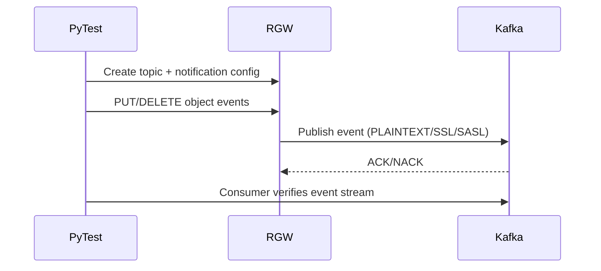

# Bucket Notification Tests

Use `bntests.conf.SAMPLE` from `src/test/rgw/bucket_notification/` as your base config for local runs (typically with `vstart.sh`).

For Kafka security tests, RGW must allow cleartext secrets:

- `rgw_allow_notification_secrets_in_cleartext=true`

## Kafka Security Tests (Local, No Docker Compose)

The supported local flow is `run-kafka-teuthology-like.sh`, which sets up a Kafka broker in a teuthology-like configuration and runs both:

- `kafka_security_test`
- `kafka_test`

### Prerequisites

- Ceph build tree present and usable at repo root
- Python venv for tests (for example: `.venv`)
- `curl`, `tar`, `openssl`, `keytool`
- Local RGW cluster available (for example: `vstart.sh`)

### Quick Start

From repo root:

```bash
./src/test/rgw/bucket_notification/run-kafka-teuthology-like.sh
```

The script will:

1. Download/extract Kafka under `.kafka-local/`
2. Generate broker/client TLS assets
3. Start Kafka (KRaft mode) with listeners for PLAINTEXT/SSL/SASL
4. Create/verify SCRAM users
5. Set `rgw_allow_notification_secrets_in_cleartext=true`
6. Run:
   - `pytest -m 'kafka_security_test'`
   - `pytest -m 'kafka_test'`

### Kafka SSL/mTLS Support

`run-kafka-teuthology-like.sh` configures Kafka listeners required by the
security tests, including SSL and mTLS paths:

- `PLAINTEXT://localhost:9092`
- `SSL://localhost:9093`
- `SASL_PLAINTEXT://localhost:9095`
- `SASL_SSL://localhost:9096`

For mTLS, broker and client certificates are generated and wired into test
configuration so RGW can publish using client-auth credentials.

### Certificate Generation

Certificates are generated by:

- `src/test/rgw/bucket_notification/kafka-security.sh`

Artifacts produced in `src/test/rgw/bucket_notification/`:

- `y-ca.crt` / `y-ca.key` (CA)
- `server.keystore.jks` / `server.truststore.jks` (broker TLS)
- `client.crt` / `client.key` (RGW mTLS client)

The runner exports:

- `KAFKA_DIR` for Kafka runtime/tooling
- `KAFKA_CERT_DIR` for TLS assets used by test topic configuration

This split ensures SCRAM admin tooling uses runtime Kafka binaries while
SSL/mTLS topic settings always reference the expected certificate directory.

### Useful Environment Variables

- `CEPH_ROOT` (default: current repo path)
- `KAFKA_VERSION` (default in script)
- `KEEP_KAFKA=1` to keep runtime dir/logs after exit

Example:

```bash
KEEP_KAFKA=1 KAFKA_VERSION=3.9.2 ./src/test/rgw/bucket_notification/run-kafka-teuthology-like.sh
```

### Running Only Specific Markers Manually

If you want manual control after setup, use the same env model as the script:

```bash
export BNTESTS_CONF="$(pwd)/src/test/rgw/bucket_notification/bntests.conf.SAMPLE"
export KAFKA_DIR="$(pwd)/.kafka-local/kafka-runtime-2.13-<version>"
export KAFKA_CERT_DIR="$(pwd)/src/test/rgw/bucket_notification"
export BN_KAFKA_HOST="localhost"

.venv/bin/python -m pytest -s src/test/rgw/bucket_notification/test_bn.py -v -m 'kafka_security_test'
```

Run only SSL and mTLS tests:

```bash
.venv/bin/python -m pytest -s src/test/rgw/bucket_notification/test_bn.py -v \
  -k 'test_notification_kafka_security_ssl or test_notification_kafka_security_mtls'
```

### Troubleshooting SSL/mTLS

Common failure signatures and fixes:

- `SSL handshake failed ... certificate verify failed`
  - Verify `KAFKA_CERT_DIR` points to `src/test/rgw/bucket_notification`.
  - Confirm `y-ca.crt`, `client.crt`, `client.key` exist there.
  - Re-run `kafka-security.sh` (or rerun the full runner script) to regenerate certs.

- `Kafka run: nack received with result=Local: Message timed out`
  - Usually follows TLS/auth failure.
  - Check RGW log (`build/out/radosgw.8000.log`) for the first SSL/SASL error before timeouts.

- `Connect to ... failed: Connection refused`
  - Broker is not up or has already been cleaned up.
  - Re-run the runner with `KEEP_KAFKA=1` and inspect `.kafka-local/.../kafka.out`.

- mTLS test cannot publish events
  - Confirm topic args resolve to:
    - `ca-location=<KAFKA_CERT_DIR>/y-ca.crt`
    - `ssl-certificate-location=<KAFKA_CERT_DIR>/client.crt`
    - `ssl-key-location=<KAFKA_CERT_DIR>/client.key`

Recommended debug run:

```bash
KEEP_KAFKA=1 ./src/test/rgw/bucket_notification/run-kafka-teuthology-like.sh
```

Then inspect:

- `.kafka-local/kafka-runtime-2.13-<version>/kafka.out`
- `build/out/radosgw.8000.log`

---

## Appendix: Script Flow

### High-Level Control Flow

```mermaid
flowchart TD
  A[Start script] --> B[Prepare .kafka-local runtime dir]
  B --> C[Download and extract Kafka]
  C --> D[Generate TLS/mTLS cert assets]
  D --> E[Write server.properties]
  E --> F[Format KRaft metadata]
  F --> G[Start broker and wait for readiness]
  G --> H[Create and verify SCRAM users]
  H --> I[Set RGW cleartext secret config]
  I --> J[Export test env vars]
  J --> K[Run pytest marker kafka_security_test]
  K --> L[Run pytest marker kafka_test]
  L --> M[Cleanup (unless KEEP_KAFKA=1)]
```

### Kafka/Auth Data Path During Tests



### Security Modes Covered

- `SSL` (TLS)
- `MTLS` (client cert)
- `SASL_PLAINTEXT` (PLAIN/SCRAM)
- `SASL_SSL` (PLAIN/SCRAM over TLS)

### Runtime Artifacts

- Kafka runtime: `.kafka-local/kafka-runtime-2.13-<version>/`
- Broker log: `.kafka-local/.../kafka.out`
- Certs used by tests: `src/test/rgw/bucket_notification/`
